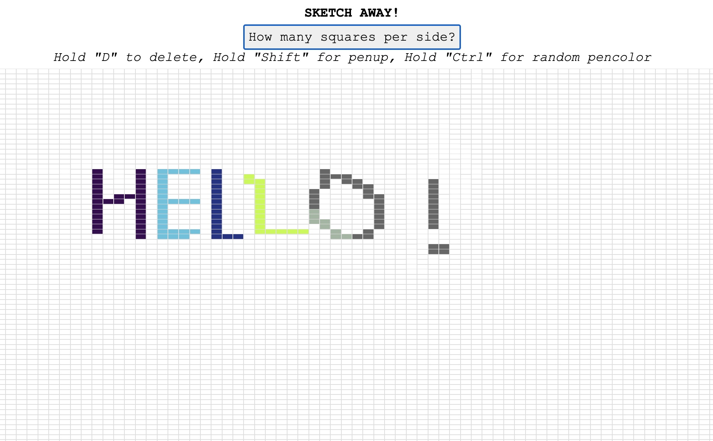

### Etch-a-sketch

Randomly sketch anything on your browser. Increase the number of squares for finer sketches.

- Press "Shift" for penup.
- Press "Ctrl" for a random pen colour.
- Press "D" and hover over your drawn traces to delete them

View live preview here [here](https://mathewbushuru.github.io/etch-a-sketch/)

